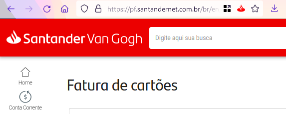
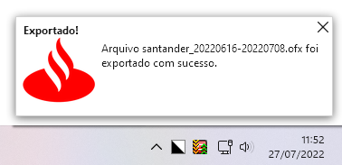

# Santander Export Extension v2

Exporta uma fatura do cartão de crédito do Internet Banking Santander para o formato OFX.
Desta forma é possível importar a fatura em outros sistemas de gestão financeira.

## Utilizando

### Acessar Internet Banking

Acesse sua fatura normalmente no site do Santander e clique no botão com o logo localizado próximo ao endereço e favorito:

Um arquivo é criado na sua pasta de downloads:

### Importe em outro sistema

Importe seu arquivo OFX em qualquer outro sistema com suporte.
